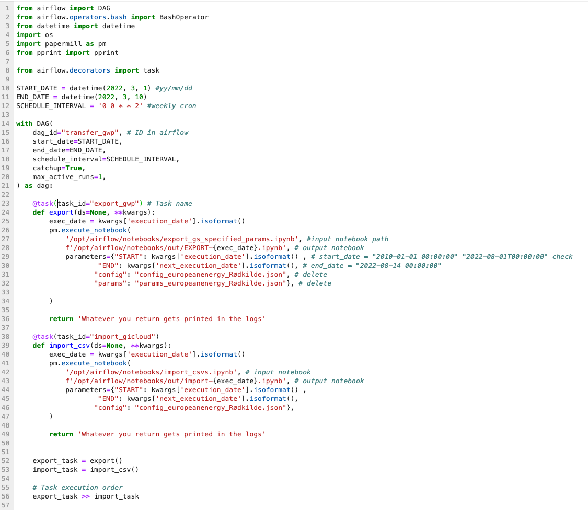
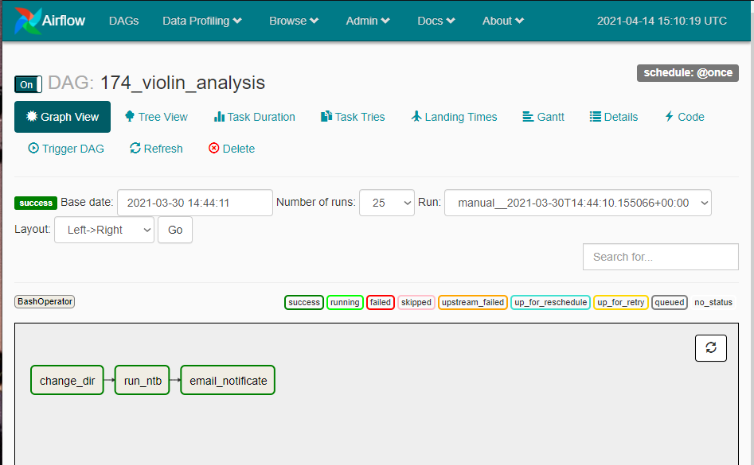

[EXPERIMENTAL] Automating/Scheduling Jupyter Notebooks
======================================================

This section explains an approach of a schedule-pipline to parameterize and execute Jupyter Notebooks.

Papermill
---------

.. warning::

    PapermillOperator is as of december 2022 not working on airflow 2.4.2

Papermill is a tool to parameterize and execute Jupyter Notebooks.
This can be done by using bash commands or as an python script.

.. note::

    The ``input`` is the Notebook which is to be executed.
    The ``output`` file is the executed Notebook with its parameterized cells and each cell output. 
    Lastly the given parameters will be defined in the ``"parameters" tagged cell`` of the notebook.

Papermill can be installed by

.. code-block:: bash

    $ pip install Papermill

and a simple example would be:

.. code-block:: bash

    $ papermill local/input.ipynb local/output.ipynb -p alpha 0.6 -p l1_ratio 0.1

For a quick overview on papermill take a look on their Github_repository_

.. _Github_repository: https://github.com/nteract/papermill

Apache Airflow
--------------

Apache Airflow is an open-source platform to Author, Schedule and Monitor workflows.

Airflow uses directed acyclic graphs (``DAGs``) to manage workflow orchestration.
Tasks and dependencies are defined in Python and then Airflow manages the scheduling and execution.
DAGs can be run either on a ``defined schedule (e.g. hourly or daily)`` or based on ``external event triggers`` (e.g. a file appearing in Hive[5]). 
Previous DAG-based schedulers like Oozie and Azkaban tended to rely on multiple configuration files and file system trees to create a DAG, whereas in Airflow,
DAGs can often be written in one Python file.

Integration
-----------

In order for apache airflow to work properly a couple of requirements need to be fullfilled.

.. deprecated:: 3.1
    To keep the encapsulation of the upright, a special type of airflow is taken (puckel_), 
    which runs in a docker container. This is used as the basis for Gantner's own airflow instance, 
    which is installed with additional dependencies via dockerfile. 
    These dependencies are almost identical to those of the jupyterlab, 
    since these notebooks are executed on the airflow container through an automated execution.

.. _puckel : https://github.com/puckel/docker-airflow

Installation: 

* Build the Dockerfile to create the specific Airflow image
* Build the Gantner JupyterLab docker image
* Make sure the image tags are correctly set inside the ``docker-compose-LocalExecutor.yml``

The repository contains a combination of airflow and jupyterlab docker-compose.yml
* Set the [optional] jupyterlab password as sha256 hash
* Ports 8888:8888 and 8080:8080 must not be blocked by other programms

Start by

.. code-block:: bash

    $ docker-compose -f docker-compose-LocalExecutor.yml up

.. warning::

    As seen in the docker-compose.yml JupyterLab and Airflow share their volumes. 
    That is needed in order to make these containers share files.
    As of currently the target directory does ``not`` have right permissions for jupyterlab to allow writing.  
    ``As a solution these permissions need to be set manually``.

After JupyterLab is running you need to set the folders with its childs executable in order for airflow to run scripts.
Open a terminal in JupyterLab:

.. code-block:: bash

    $ chmod -R 777 /opt/airflow/notebooks

Usage
-----------------------------------

Both Docker containers(J-lab and Airflow) are using the same volumes to enable shared folders.

Having a shared sort of folder is necessary in order to have access to input and output to the same files from both of these containers.

But this could be changed to docker-swarm for example in the future.
Also a folder structure should be designed, since currently dags and scripts are located in the same directory.

An example of usage:

You have the following items inside the jupyterlab:

- Jupyter Notebook script
- Python script describing an ****airflow DAG ****

A DAG simply descibes an usecase, which can consist of multiple tasks.
These tasks get described and furthermore schedule intervals are described.
The order of which tasks are dependend of each other is also defined.
Airflow will then run these tasks in the given intervall parallel.

To learn more about DAG's and Airflow visit their documentation_.

.. _documentation: https://airflow.apache.org/docs/

Here is an example of how a DAG could look like.

    In this example dag papermill is beeing used inside an BashOperater (acts as bash).

Afterwards Airflow will give you the option to enable this dag, see logs, running times and alot more.

    

TLDR
----

Basically in an airflow dag we can define which parameters we want to pass to the notebook that we are about to run.
In order for this to work we need to set a cell tag "parameters" inside the input notebook as described above.
Airflow will then run it and pass the parameters to this cell. Afterwards a output notebook can be saved.