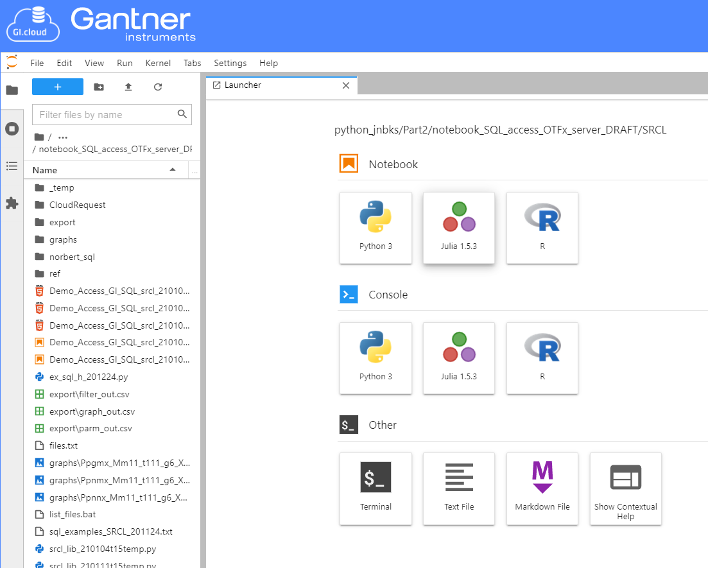
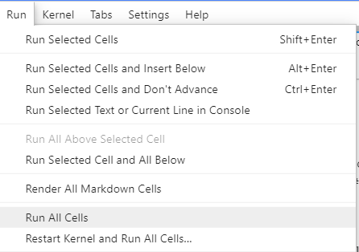
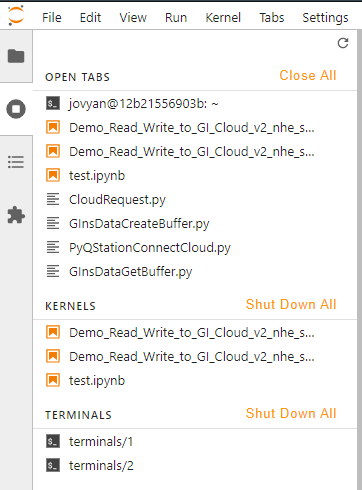

========
Overview
========

JupyterLab enables you to work with documents and activities such as Jupyter notebooks, 
text editors, terminals, and custom components in a flexible, integrated, and extensible manner.

The core target is to have a tool for data analysis and data visualization.
For that manner, Jupyter Notebooks are being used, which can be run interactively.

Getting started
---------------

Open the JupyterLab via the Tools embedded to the GI.cloud web-ui.

This working environment where you can inspect files and run python scripts.

To manually install required packages, you can open a ``terminal`` to execute linux commands.

.. note::

    If you want to experiment with different packages and dependencies, it is recommended to create a virtual environment.

Set up a venv with pip:  
https://dev.gantner-instruments.com/webfiles/public/Download/Software/Python/ginsapy/doc/build/html/installation.html#set-up-a-virtual-environment

or with conda:  
https://www.digitalocean.com/community/tutorials/how-to-install-anaconda-on-ubuntu-18-04-quickstart

The most of the delivered Jupyter Notebook scripts can simply be executed sequentially.
That means that once you opened a ``.ipynb`` file, you can either run Cell by Cell by pressing ``shift + enter``, or go on tab 'run' and ``Run All Cells``.

.. warning:: 

    The Python **kernel** of **JupyterLab can only consist** if enough memory is available to be allocated.
    This can be an issue if the memory is limited, but currently running kernels still occupy memory.

To shutdown running kernels that are not needed, simply head to "Running Terminals and Kernels" Tab on the left-hand side.
There you have the option to Shut Down running kernels and hence free some memory.

